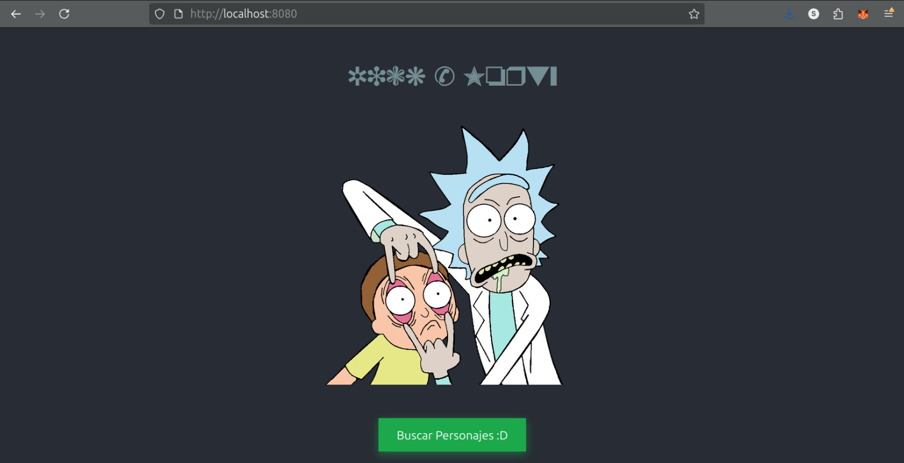

# Docker CI/CD Project for a React Application

**Student:** Santiago Valencia García - A00395902  
**Professor:** Christian David Flor Astudillo  
**Date:** October 2, 2025  
**Course:** Software Engineering V  
Barberi School of Engineering, Design, and Applied Sciences  
Universidad Icesi. Cali, Valle del Cauca, Colombia

---

## Introduction

This project demonstrates a complete Continuous Integration and Continuous Deployment (CI/CD) pipeline for a web application. The process involves containerizing a React application using Docker, and then automating the build and publication of the container image to Docker Hub through a GitHub Actions workflow. The final result is a production-ready image that can be deployed anywhere, including locally for testing.

---

## End-to-End CI/CD Process

This section provides a detailed, step-by-step guide of the entire implementation.

### Step 1: Containerizing the Application with a Dockerfile

The foundation of this process is the `Dockerfile`, which contains the instructions to package the React application into a standardized container image. A **multi-stage build** strategy is used to create a lean, secure, and optimized production image.

-   **Build Stage:** A temporary build environment is created using a Node.js image. In this stage, all the necessary dependencies are installed, and the React application is compiled into static HTML, CSS, and JavaScript files.
-   **Production Stage:** A new, lightweight Nginx web server image is used as the base. Only the compiled static files from the build stage are copied over. This ensures that the final image does not contain any development dependencies, source code, or unnecessary build tools, resulting in a smaller and more secure container.

### Step 2: Setting Up Secure Credentials

To allow the automated pipeline to publish images to Docker Hub, secure authentication must be configured. This is done by generating a Personal Access Token and storing it securely in GitHub.

1.  **Generate Docker Hub Access Token:** A new Personal Access Token is created in the user's Docker Hub account under **Account Settings > Security**. This token is granted read, write, and delete permissions, allowing it to manage repositories.

2.  **Configure GitHub Secrets:** The credentials are then stored in the GitHub repository as encrypted secrets under **Settings > Secrets and variables > Actions**. Two secrets are created:
    -   `DOCKERHUB_USERNAME`: The user's Docker Hub ID.
    -   `DOCKERHUB_TOKEN`: The Personal Access Token generated in the previous step.

This method ensures that sensitive credentials are never exposed directly in the source code.


### Step 3: Automating the Pipeline with GitHub Actions

The CI/CD pipeline is defined in the `.github/workflows/docker-publish.yml` file. This workflow automates every step from code commit to image publication.

-   **Trigger:** The workflow is configured to run automatically on every `push` to the `main` branch.
-   **Execution Flow:** When triggered, the workflow executes the following jobs on a GitHub-hosted runner:
    1.  **Checkout Code:** It first checks out the latest version of the repository's code.
    2.  **Set Up Docker:** It prepares the Docker build environment.
    3.  **Log In to Docker Hub:** It securely logs into Docker Hub using the previously configured secrets.
    4.  **Build and Push:** It builds the Docker image using the `Dockerfile` and pushes the newly created image to the Docker Hub repository, tagging it as `latest`.

### Step 4: Verifying the Pipeline Execution

After pushing a change to the `main` branch, the pipeline's execution can be monitored in the "Actions" tab of the GitHub repository.

-   **Pipeline in Progress:** The workflow shows the current step being executed.

    

-   **Successful Execution:** A green checkmark indicates that all steps, including the final push to Docker Hub, have been completed successfully.

    

-   **Final Artifact on Docker Hub:** The successful run results in the new image being available in the public Docker Hub repository, ready for deployment.

    

---

## Local Deployment and Verification

The CI/CD pipeline handles the creation and publication of the image. To run and view the application, the image must be pulled from Docker Hub and executed as a container on a local machine with Docker installed.

### Step 1: Pull the Image from Docker Hub

Open a terminal and run the following command to download the application image to your local machine.

```bash
docker pull santiagovg/docker-test:latest
```

### Step 2: Run the Docker Container

Execute the following command to start a container from the downloaded image. This command also maps a local port to the container's port, allowing you to access the application.

```bash
docker run -d -p 8080:80 santiagovg/docker-test:latest
```

### Step 3: Access the Application

Once the container is running, open a web browser and navigate to the following URL:
http://localhost:8080


