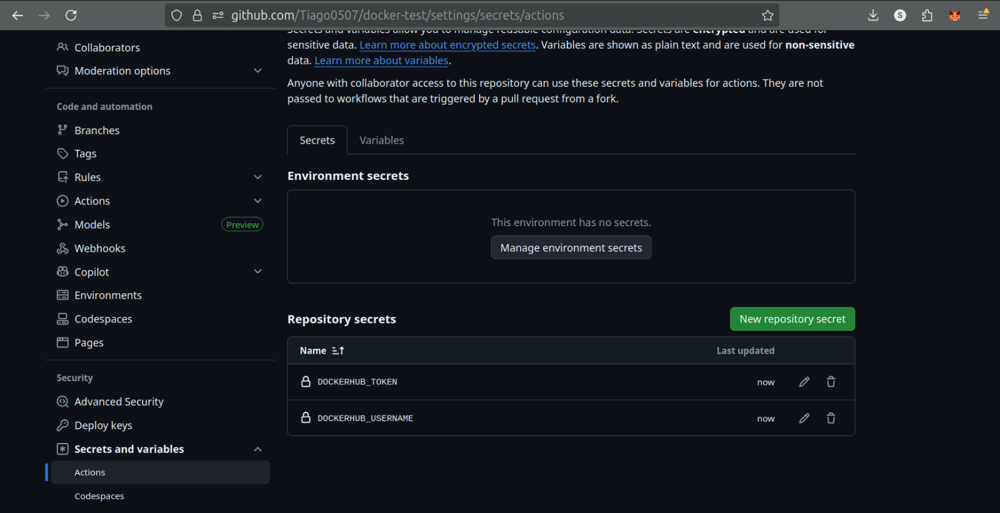
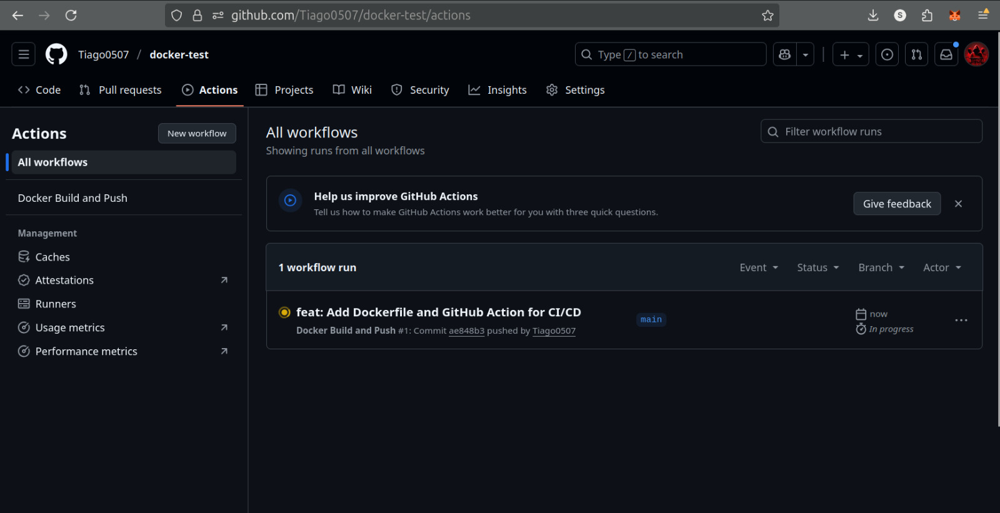
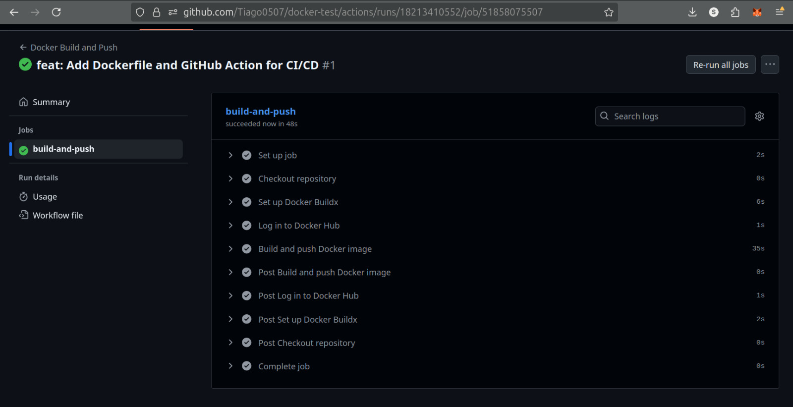
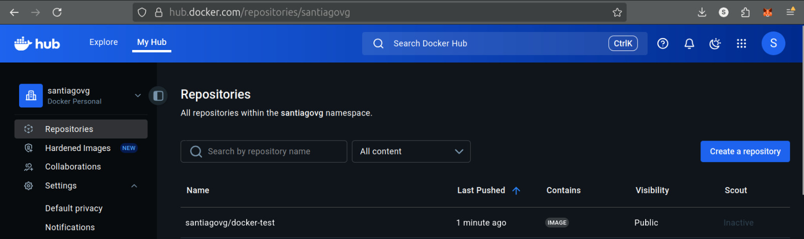

# Docker CI/CD Project for a React Application

**Student:** Santiago Valencia García - A00395902  
**Professor:** Christian David Flor Astudillo  
**Date:** October 2, 2025  
**Course:** Software Engineering V  
Barberi School of Engineering, Design, and Applied Sciences  
Universidad Icesi. Cali, Valle del Cauca, Colombia

---

## Project Configuration

This section provides a high-level overview of the core files used for containerization and automation.

### Dockerfile Strategy

The project uses a `Dockerfile` with a multi-stage build approach. This is a best practice for building web applications as it produces a final image that is optimized for production.

-   **Why Multi-Stage?** The first stage (the "build stage") uses a Node.js environment to compile the React application and its dependencies into static files. The second stage (the "production stage") starts from a fresh, lightweight Nginx web server image and copies *only* the static files from the first stage.
-   **Benefits**: This method drastically reduces the final image size and improves security by excluding build tools, development dependencies, and source code from the production container. The result is a lean, fast, and secure image.

### GitHub Actions Workflow

Automation is handled by a workflow file located at `.github/workflows/docker-publish.yml`. This file defines a CI/CD pipeline that automates the process from code push to image deployment.

-   **Trigger**: The pipeline is configured to run automatically on every `push` to the `main` branch, ensuring that the latest code is always deployed.
-   **Process**: The workflow executes a series of automated steps on a GitHub-hosted runner. It checks out the code, prepares the Docker build environment, securely logs into Docker Hub using credentials stored as repository secrets, and finally builds and pushes the image. This creates a fully automated and reliable deployment process.

---

## CI/CD Pipeline Implementation

This document outlines the steps followed to create a CI/CD pipeline that automatically builds a Docker image from a React application and deploys it to Docker Hub using GitHub Actions.

### 1. GitHub Secrets

To ensure a secure connection with Docker Hub, repository secrets are configured in GitHub. Two secrets are created: `DOCKERHUB_USERNAME` for the user ID and `DOCKERHUB_TOKEN` for a personal access token with write permissions. This avoids exposing sensitive credentials directly in the workflow file.

### 2. Running the Pipeline

The pipeline is triggered automatically on every push to the `main` branch. The GitHub Actions workflow checks out the code, sets up the Docker build environment, logs into Docker Hub using the configured secrets, and starts the build and push process.

### 3. Successful Pipeline

Once all the steps are completed without errors, the workflow shows a successful run. This confirms that the Docker image has been built correctly according to the `Dockerfile` and has been pushed to the specified container registry.

### 4. Deployment on Docker Hub

The final result of the pipeline is a new image pushed to Docker Hub. The image is tagged as `latest`, indicating it is the most recent version of the application. This image is now available for deployment in any environment that supports Docker containers.

